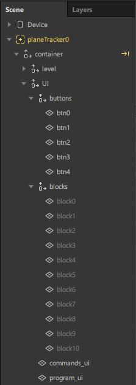

= Spark AR Scripting Tutorial: Build an AR Puzzle Game

== Introduction

In this tutorial, we will build a Spark AR World effect game. You will learn how to use JavaScript to add logic and interactivity to your effects.

=== Key Concepts

This tutorial will cover the following key concepts:

- Writing game logic in Spark AR with JavaScript

- Working with reactive programming in Spark AR

- Adding animations in Spark AR with scripting

=== What We'll Build

This tutorial will guide you in a step-by-step process to create a 3D puzzle game called Rabbit Coder, it's a game that helps first-time coders learn about the basic concepts of programming through puzzles. I created https://devpost.com/software/rabbit-coder[Rabbit Coder] for the first Facebook AR hackathon and won first place. You can try out the game https://www.facebook.com/fbcameraeffects/tryit/208527660353698/[here] for yourself.

image::images/demo-gif.gif[Game,width=240]

By the end of this tutorial, you should have learned how to build a 3D game with complex game logic in Spark AR.

NOTE: To make this tutorial easier, we will not add all the features of Rabbit Coder, we'll just focus on the main concepts of the game. The following topics will *not* be included:

- Obstacle and switche levels
- Loop levels

=== Rabbit Coder Game Design

The objective of the game is to get the rabbit to the carrot using commands such as *forward*, *left*, and *right*, you need to insert these commands in the game and press the play button to execute them. The image below shows an example of one of the levels. The player must pass through the path and reach the goal without going on the danger zone.

In the game, commands are represented by blocks, these commands are executed from top to bottom, the executor will iterate through each command and if the command is equal to *forward* then the rabbit will move one step forward if the command is equal to *left* or *right* the rabbit will turn 90 degrees in the respective direction. The image below shows a simplified example of the command blocks.

image::images/commands.png[Commands]

In the commands above the rabbit will move 2 steps forward turn left and move one step forward.

=== Knowledge Prerequisites

Make sure you meet the following knowledge prerequisites before starting the tutorial:

* You must have basic knowledge of JavaScript

* You must have a basic understanding of Spark AR studio

== Getting Started

=== Software Prerequisites

For this tutorial you will need:

* Spark AR Studio v97

* Visual Studio Code (any code editor will work too)

=== Downloading the Project

To follow this tutorial:

. https://github.com/harrybanda/Rabbit-Coder-Sample-Starter[Download the sample project].

. Open the sample project in Spark AR Studio v97 and above.

I have already imported the required game assets you need to help you get started.

== Setting Up the Scene

Before we start adding in the the game logic, we need to set up the scene. In Spark AR game objects cannot be created dynamically with a script so we need to add them to the scene before we can access them in the script.

=== Understanding the Assets

Within the Assets Panel you'll find five folders and four 3D assets:

- *Bunny* is the main character in the game
- *Carrot* is the objective that the rabbit needs to reach
- *tile* is the platform the rabbit will hop on
- *Wall* surrounds the water in the game
- *Textures* contains the 2D images required by the game
- *Animation Sequences* contains the water animation
- *Audio* contains all the sound effects our game will need

Within the *Scene* panel of the starter project you'll find a plane tracker with an empty null object inside it called *container*

image::images/1.JPG[Image]

=== Adding Null Objects

Null objects act as empty groups and are a great way of grouping objects together, In this project, we'll group our objects into two groups called *level* and *UI*.

To add a null object:

. Right-click *container*
. Select *Add > Null Object*
. Rename the null object to *level*
. Create another null object inside *container* and rename it to *UI*

The *level* null object will contain all our game objects and the *UI* null object will contain our 3D user interface elements an shown in the game. Next:

. Create a null object called *platforms* in *level*. 

. Create a null object named *buttons* in *UI*

. Create another null object named *blocks* in *UI*

The *platforms* null object will contain all the platforms that the rabbit will hop on. While *buttons* will contain Planes that will act as buttons in the game and *blocks* will contain Planes that will act as command blocks. In Spark AR Studio, a Plane is a flat 3D object that can be positioned at any depth within the scene.

Your *Scene Panel* should look like this:

=== Adding Game Objects

Next, click and drag the *bunny* asset into *level* to add it as a child. Do the same for the *carrot* and the *wall*.

We're also going to update the scale values of the 3D objects so that it fits the plane tracker.

. Select the *bunny* object in the Scene Panel.
. Change the *x, y, and z-axis* scale to 0.15 in the Inspector Panel.

image::images/4.JPG[Image]

And for the *carrot* use the following values:

=== Adding Platforms

The rabbit will hop on platforms to reach the carrot, normally with game engines, we can dynamically create objects with a script, the Spark AR scripting module does not allow us to create objects dynamically so we are going to duplicate the *platform* object from the *Scene Panel* manually.

. Select and drag the *tile* from the *Assets Panel* into the *platforms* null object.

. Change the *x, y, z scale* to *0.1* in the Inspector Panel

. Rename *tile* to *platform0*

. Right-click on *plaform0* and Click *Duplicate* this will create another platform object.

. Go to the next platform object and repeat the duplication process until *plaform9*

Your *Scene Panel* should look like this:

image::images/6.JPG[Image]

And we should have something like this in the 3D view:

=== Adding Water

In the game when we enter a wrong command the rabbit will fall from a platform into the water, so the next thing we'll add is a Plane with an animated texture to represent water.

. Right-click *level*.
. Select *Add > Plane*
. Rename the plane to *water*
. Change the scale and rotation of the *water* plane to look like this:

Your 3D scene should look like this:

Now to add the animated water texture:

. Select the *water* plane
. In the Inspector panel click the *+* button next to *materials*
. Select the *water* material in the drop-down

image::images/10.JPG[Image]

This will apply a looped animation sequence with 32 frames. I created this animation by attaching the *frame_[1-32]* texture to the *water_animation* sequence and attaching the animation sequence to the *water* material. Originally the animation texture was a gif file, I had to convert it to frames before importing it to Spark AR Studio.

=== Adding a 3D User Interface

Next, we are going to add the 3D user interface, first let's add the buttons:

. Right-click *buttons* then *Add > Plane* to create a new plane
. Name the plane *btn0*
. Duplicate the button so that we have *btn0* to *btn3*

Each button will have its own functionality, material, and transform values:

. *btn0* -> will add the command to move forward

. *btn1* -> will add the command to turn left

image::images/12.JPG[Image]

. *btn2* -> will add the command to turn right

image::images/13.JPG[Image]

. *btn3* -> will execute the commands

Add one more plane in *buttons* name it *commands_ui* this will act as the background of our UI. Give it the following transform and material values:

image::images/15.JPG[Image]

You should see this in your scene:

image::images/19.JPG[Image,width=480]

Next, the UI needs to be re-arranged click the *UI* null object and add the following transform values:

image::images/UI.JPG[Image]

Next, add the following transform values to the *buttons* null object:

image::images/20.JPG[Image]

Add this to the *blocks* null object:

Now we need to add the command blocks:

. Right-click *blocks* then *Add > Plane* to create a new plane
. Name the plane *block0*
. Untick visible in the inspector panel
. Give it the following transform values:

Command blocks represent our commands visitually, initially we hide the blocks so that the player only sees the ones that are added.

 - Next duplicate the hidden blocks so that we have *block0* to *block9*. 
 - Create one more plane and name it *program_ui* this will be the background for our command blocks, give it the following transform and material:

image::images/17.JPG[Image]

We need to add one more button to the *blocks* null object:

. Right-click *blocks* > *Add* > *Plane*
. Name the plane *btn4*
. Give the plane the following transform and material values.

This button will allow us to remove blocks from the command window.

Your final *Scene Panel* should look like this:

And your final scene should look like this:

== Scripting Rabbit Coder

In this section, we are going to focus on building game logic with the Scripting module.

. Click on *Add Asset* > *Script* to add a *script.js* file
. Add another script file and name it *levels.js*
. Open the *script.js* file and remove any code in there.

=== Importing Objects

Add this code to your script.js:

[source,javascript]
----
const Scene = require("Scene");
----

The `require()` method tells the script we're looking for a module, we pass in the name of the module as the argument to specify the one we want to load. The *Scene* variable now contains a reference to the *Scene Module* that can be used to access the module's properties, methods, classes, and enums. Now we are going to add this code 
below:

[source,javascript]
----
Promise.all([

]).then(function (results) {

});
----

A promise is an object that may produce a single value some time in the future, either a resolved value or a reason that it’s not resolved. Inside the promise, we are going to import our game objects from the *Scene*. Your Code should look like this:

[source,javascript]
----
Promise.all([
  Scene.root.findFirst("bunny"),
  Scene.root.findFirst("carrot"),
  Scene.root.findFirst("blocks"),
  Scene.root.findFirst("platforms"),
  Scene.root.findFirst("buttons"),
]).then(function (results) {
  // Game objects
  const player = results[0];
  const carrot = results[1];
  const blocks = results[2];
  const platforms = results[3];
  const buttons = results[4];
});
----

In the code above we are importing our objects from the *Scene* using `promise.all`, so in this case only when the imported objects are found will the code in the `then(function (){})` function run. We can access objects from *results* and assign a variable to them.
If you have noticed we have imported two 3D objects *bunny and carrot* and three null objects *blocks, platforms, and buttons* we are going to use these null objects to access the objects inside them later on in the tutorial. Next, we are going to import the audio files:

First, add this line at the top of your script just below the Scene import:

[source,javascript]
----
const Audio = require("Audio");
----

Next update your `promise.all` code to look like this:

[source,javascript]
----
Promise.all([
  Scene.root.findFirst("bunny"),
  Scene.root.findFirst("carrot"),
  Scene.root.findFirst("blocks"),
  Scene.root.findFirst("platforms"),
  Scene.root.findFirst("buttons"),
  Audio.getAudioPlaybackController("jump"),
  Audio.getAudioPlaybackController("drop"),
  Audio.getAudioPlaybackController("fail"),
  Audio.getAudioPlaybackController("complete"),
  Audio.getAudioPlaybackController("click"),
  Audio.getAudioPlaybackController("remove"),
]).then(function (results) {
  // Game objects
  const player = results[0];
  const carrot = results[1];
  const blocks = results[2];
  const platforms = results[3];
  const buttons = results[4];

  // Game sounds
  const jumpSound = results[5];
  const dropSound = results[6];
  const failSound = results[7];
  const completeSound = results[8];
  const clickSound = results[9];
  const removeSound = results[10];
});
----

From the code above we have imported the *Audio* module and added `getAudioPlaybackController`, the audio playback controller can be used to play sound continuously on a loop in your AR effect or add one-shot triggered audio in response to boolean signals.

=== Generating Levels

In this game a level is represented by a 5 x 5 grid of coordinates, on this grid we shall specify which coordinates are part of the *path* or the *danger zones*.

- *Path* -> the coordinates that the rabbit can hop on
- *Danger Zone* -> the coordinates that the rabbit *cannot* hop on.

Each level has different *path* and *danger zone* coordinates the image below shows an example for a level, the *green* squares represent *path* coordinates while the *red* squares represent *danger zone* coordinates. In the image below the path coordinates are: *[3,2] [3,3] [3,4]*.

image::images/grid_1.png[Image]

Now that we have an idea of how that path is going to be generated we are going to define the path coordinates for each level in the *levels.js* file.

. Open *levels.js* in your code editor and add the following code:

[source,javascript]
----
module.exports = [
  // level 1
  {
    path: [
      [2, 3],
      [3, 3],
      [4, 3],
    ],
    facing: "east",
  },
  // level 2
  {
    path: [
      [2, 4],
      [2, 3],
      [3, 3],
      [4, 3],
    ],
    facing: "north",
  },
  // level 3
  {
    path: [
      [4, 4],
      [3, 4],
      [3, 3],
      [3, 2],
      [2, 2],
    ],
    facing: "west",
  },
];

----

From the code above we are exporting an array of objects, each object in the array represents a level and each level has the following attributes:

- *Path* -> These are the coordinates of the path as explained above.
- *facing* -> This is the direction in which the rabbit will face when the level loads.

In the *script.js* add this line of code to import the levels:

[source,javascript]
----
const levels = require("./levels");
----

Next create a function called *initLevel*

[source,javascript]
----
...

/*------------- Initialize current level -------------*/

function initLevel() {

}

initLevel();
----

The *initLevel* function will run when the effect is launched. 

==== Generating Grid Coordinates

Before we can generate the path and danger zone coordinates we need to define a grid of *all* the coordinates.

Just below the *levels* variable add this code:

[source,javascript]
----
  const gridSize = 0.36;
  const gridInc = 0.12;

  let allCoordinates = createAllCoordinates();

  function createAllCoordinates() {
    // Creates a grid of coordinates
    let coords = [];
    for (let i = -gridSize; i <= gridSize; i += gridInc) {
      for (let j = -gridSize; j <= gridSize; j += gridInc) {
        let x = Math.round(i * 1e4) / 1e4;
        let z = Math.round(j * 1e4) / 1e4;
        coords.push([x, z]);
      }
    }
    return coords;
  }
----

The default unit of measurement in Spark AR is Meters, so our values will be in meters. In the code above we use the `gridSize` constant represents the size of the grid in *meters* while `gridInc` is the increment value that is added to the positon value of each paltform in order to form a grid. Each box in the grid has a size of *0.072* meters. The `createAllCoordinates` function has a nested for loop that generates a 7 X 7 grid, the generated coordinate values are then stored in the `allCoordinates` variable.

==== Generating Path Coordinates

Add this code along with the other variables:

[source,javascript]
----
let currentLevel = 0;
let pathCoordinates = createPathCoordinates();
----

The code above will represent the current level as a number, since we only have 3 levels,  `currentLevel` can be 0, 1 or 2. Next add the following function:

[source,javascript]
----
 function createPathCoordinates() {
    // Get the current level path coordinates from all the coordinates
    let path = levels[currentLevel].path;
    let coords = [];
    for (let i = 0; i < path.length; i++) {
      let x = allCoordinates[path[i][0]][1];
      let z = allCoordinates[path[i][1]][1];
      coords.push([x, z]);
    }
    return coords;
  }
----

This function will generate values from the path defined in the level and `allCoordinates`.

==== Generating Danger Zone Coordinates

Add this line of code along with the other variables:

[source,javascript]
----
 let dangerCoordinates = createDangerCoordinates();
----

This will hold all the coordinates except the path coordinates. Next add this code:

[source,javascript]
----
  function createDangerCoordinates() {
    // Get the danger coordinates by removing the current path coordinates
    let coords = allCoordinates;
    for (let i = 0; i < pathCoordinates.length; i++) {
      for (let j = 0; j < coords.length; j++) {
        let lvlCoordStr = JSON.stringify(pathCoordinates[i]);
        let genCoordStr = JSON.stringify(coords[j]);
        if (lvlCoordStr === genCoordStr) {
          coords.splice(j, 1);
        }
      }
    }
    return coords;
  }

----

The danger zones are generated by subtracting the `pathCoordinates` from the `allCoordinates`

==== Placing Level Objects

Next we are going to focus on positioning the rabbit, carrot and platforms using the coordinates we just generated. First add the following vaiables to your code:

[source,javascript]
----
let playerDir = levels[currentLevel].facing;
let platformsUsed = 0;
const numOfPlatforms = 10;
const playerInitY = 0.02;
----

- `playerDir` gets the direction the rabbit should face from *levels.js*
- `platformsUsed` holds the number of platforms that have been shown in the level
- `playerInitY` is the players initial position in the Y-axis

Next in the `initLevel()` function add the following code:

[source,javascript]
----

    playerDir = levels[currentLevel].facing;

    // Set the player's initial position
    player.transform.x = pathCoordinates[0][0];
    player.transform.z = pathCoordinates[0][1];
    player.transform.y = playerInitY;

    // set carrot position
    let goalX = pathCoordinates[pathCoordinates.length - 1][0];
    let goalZ = pathCoordinates[pathCoordinates.length - 1][1];
    carrot.transform.x = goalX;
    carrot.transform.z = goalZ;
    carrot.transform.y = 0.03;
    carrot.hidden = false;

    // Set the player's initial direction
    if (playerDir === "east") {
      player.transform.rotationY = 0;
    } else if (playerDir === "north") {
      player.transform.rotationY = degreesToRadians(90);
    } else if (playerDir === "west") {
      player.transform.rotationY = degreesToRadians(180);
    } else if (playerDir === "south") {
      player.transform.rotationY = degreesToRadians(270);
    }

    // Add the path platforms
    for (let i = 0; i < pathCoordinates.length; i++) {
      let path = pathCoordinates[i];
      let x = path[0];
      let z = path[1];
      let platform = platforms.child("platform" + platformsUsed++);
      platform.transform.x = x;
      platform.transform.z = z;
      platform.hidden = false;
    }
  }
----

The code above will first set the direction that the rabbit should face, next we set the player's initial position. From the `pathCoordinates` the first coordinate is always the rabbit's initial position and the last coordinate is always the position of the carrot. After that, we transform the rabbit's position based on the direction defined in the level. Lastly, we draw the path in the scene by iterating through `pathCoordinates`, getting each path, and applying it to a platform in the Scene. Save the code and check your Scene you should see that we have a level generated with three platforms.

You can try changing the `currentLevel` value to *1* or *2* you should see that the level arrangement changes.

=== Adding Commands

Now that we can generate levels it's time to make the rabbit move but before we do that let's first set up the commands. Commands allow us to instruct the rabbit what to do, in this game we are going to have 3 commands, *move forward*, *turn left* and *turn right*. To add commands we need to tap the 3D planes we added in the *buttons* null object, to do that add the following code at the top of your script

[source,javascript]
----
const TouchGestures = require("TouchGestures");
const Materials = require("Materials");
----

The `TouchGestures` class enables touch gesture detection, in our case we are going to use it to detect buttons taps and the `Materials` module provides access to the materials in an effect.

Before we can add the commands we need to declaire some variables that are going to be needed. Add the following code at the top:

[source,javascript]
----
  const states = {
    start: 1,
    running: 2,
    complete: 3,
    failed: 4,
    uncomplete: 5,
  };
  let currentState = states.start;
  let commands = [];
  let blocksUsed = 0;
  const blockSlotInc = 0.1;
  const initBlockSlot = 0.6;
  const numOfBlocks = 10;
  const blockInitY = 0.9;
  let nextBlockSlot = initBlockSlot;
----

In the code above `state` represents the current state of the game, we have 5 states:

- *start* -> this is the initial game state
- *running* -> this is when the game is running e.g the rabbit is moving
- *complete* -> this state is called when a level is successfully completed
- *failed* -> this state is called when the rabbit enters the danger zone
- *uncomplete* this state is called when the rabbit does not fall off but also does not reach the goal.

The `commands` array stores all the commands that the player inserts e.g *forward*, *left*, *Right*.

`BlocksUsed` stores the number of blocks that the player has added, we use this to keep track of the number of blocks so that we do not go over the maximum number.

`blockSlotInc` is the value that the added blocks are offset by, e.g. when a user adds a new command block it will be placed *0.1* meters lower.

`InitBlockSlot` is the initial block position

`numOfBlock` is the maximum number of blocks that we have in the Scene, If we wanted to add 3 more blocks we would change the number to 13 and duplicated 3 more blokes in the Scene panel.

`nextBlockSlot` represents the next slot that is available for a block to be inserted. 

Now that we have the variables its time to add the logic, add the following code:

[source,javascript]
----
 function addCommand(move) {
    if (currentState === states.start) {
      if (blocksUsed < numOfBlocks) {
        let block = blocks.child("block" + blocksUsed++);
        nextBlockSlot -= blockSlotInc;
        block.transform.y = nextBlockSlot;
        block.material = Materials.get(move + "_block_mat");
        block.hidden = false;
        commands.push({ command: move, block: block });
        clickSound.setPlaying(true);
        clickSound.reset();
      }
    }
  }
----

The `addCommand` function above takes in a string value called *move* this value can either be `"forward"`, `"left"` or `"right"`. On the next line, we check if *currentState* is equal to the initial state, then we can add blocks. In the second If statement we check if the blocks that have been used are greater than the max number of blocks, we have in our scene. In this case, if we run out of command blocks we prevent the game from trying to access blocks that do no exist.

From the code above this line `let block = blocks.child("block" + blocksUsed++);` looks for the block in the *blocks* null object by it's name. 

[source,javascript]
----
nextBlockSlot -= blockSlotInc;
block.transform.y = nextBlockSlot;
block.material = Materials.get(move + "_block_mat");
block.hidden = false;
----

From the lines above first, we set the position of the next slot and insert the block on that slot. we then apply the correct material based on the name of the block and make it visible. On the last 3 lines, we add the blocks to the `commands` array and play a sound effect.

Next add the following code anywhere inside the promise *then* function:

[source,javascript]
----
for (let i = 0; i < 4; i++) {
    let button = buttons.child("btn" + i);
    TouchGestures.onTap(button).subscribe(function () {
      switch (i) {
        case 0:
          addCommand("forward");
          break;
        case 1:
          addCommand("left");
          break;
        case 2:
          addCommand("right");
          break;
        case 3:
          break;
      }
    });
  }
----

The for loop above iterates through all the buttons in our null object and assigns an `onTap` listener to each button. We then add a switch statement to call the `addCommand` function we added passing in the respective command.

Now we should be able to click the buttons and add the command blocks.

Next lets add the code to remove added blocks:

[source,javascript]
----
  TouchGestures.onTap(blocks.child("btn4")).subscribe(function () {
    removeSound.setPlaying(true);
    removeSound.reset();
    if (blocksUsed !== 0 && currentState === states.start) {
      let popped = commands.pop();
      popped.block.transform.y = blockInitY;
      popped.block.hidden = true;
      nextBlockSlot += blockSlotInc;
      blocksUsed--;
    }
  });
----

The code above allows us to remove the bottom block, we do this by popping the last command using javaScript `commands.pop();` and hiding the block we also move it back to its initial position. You can try to click the *Bin* button after adding some blocks you should see them getting removed.

=== Moving the Rabbit

Now that we have the commands logic all set up it's time to make the rabbit move. Inorder to make the rabbit move we need to execute the commands that the user as entered to do that we need to write an executer function that iterates through each command in the `commands` array. Create a function called *executeCommands* and add the following code inside the function:

[source,javascript]
----
function executeCommands() {
    currentState = states.running;
    let executionCommands = [];
    for (let i = 0; i < commands.length; i++) {
      executionCommands.push(commands[i].command);
    }
    setExecutionInterval(
      function (e) {
        animatePlayerMovement(executionCommands[e]);
      },
      1000,
      executionCommands.length
    );
  }
----

The function above iterates through each command, gets the command value e.g. *forward*, *left* or *right*, and sets and execution interval of 1 second. Next import the *Time*, *Texture* and *Animation* module then add a variable *exeIntervalID* like this:.

[source,javascript]
----
const Time = require("Time");
const Textures = require("Textures");
const Animation = require("Animation");
let exeIntervalID;
----

And add the *setExecutionInterval* function:

[source,javascript]
----
 function setExecutionInterval(callback, delay, repetitions) {
    let e = 0;
    callback(0);
    exeIntervalID = Time.setInterval(function () {
      callback(e + 1);
      if (++e === repetitions) {
        Time.clearInterval(exeIntervalID);
        if (currentState === states.running) currentState = states.uncomplete;
        setTexture(buttons.child("btn3"), "retry");
        failSound.setPlaying(true);
        failSound.reset();
      }
    }, delay);
  }

----

The *setExecutionInterval* function takes in a callback, delay and repetations this will allow us to move the rabbit after 1 second. The callback function will contain the movement animation code. Next add the *setTexture* function we need this to dynamicaly apply textures to objects:

[source,javascript]
----
  function setTexture(object, texture) {
    let signal = Textures.get(texture).signal;
    object.material.setTextureSlot("DIFFUSE", signal);
  }
----

==== Adding Animations

Now that our command execution code is all set up let us focus on Animations, to make the rabbit move forward and turn we are going to use Spark AR's *Animation Module*. Add the following function

[source,javascript]
----
  function animatePlayerMovement(command) {
    const timeDriverParameters = {
      durationMilliseconds: 400,
      loopCount: 1,
      mirror: false,
    };

    const timeDriver = Animation.timeDriver(timeDriverParameters);
    const translationNegX = Animation.animate(
      timeDriver,
      Animation.samplers.linear(
        player.transform.x.pinLastValue(),
        player.transform.x.pinLastValue() - gridInc
      )
    );

    const translationPosX = Animation.animate(
      timeDriver,
      Animation.samplers.linear(
        player.transform.x.pinLastValue(),
        player.transform.x.pinLastValue() + gridInc
      )
    );

    const translationNegZ = Animation.animate(
      timeDriver,
      Animation.samplers.linear(
        player.transform.z.pinLastValue(),
        player.transform.z.pinLastValue() - gridInc
      )
    );

    const translationPosZ = Animation.animate(
      timeDriver,
      Animation.samplers.linear(
        player.transform.z.pinLastValue(),
        player.transform.z.pinLastValue() + gridInc
      )
    );

    const rotationLeft = Animation.animate(
      timeDriver,
      Animation.samplers.linear(
        player.transform.rotationY.pinLastValue(),
        player.transform.rotationY.pinLastValue() + degreesToRadians(90)
      )
    );

    const rotationRight = Animation.animate(
      timeDriver,
      Animation.samplers.linear(
        player.transform.rotationY.pinLastValue(),
        player.transform.rotationY.pinLastValue() - degreesToRadians(90)
      )
    );

    const jump = Animation.animate(
      timeDriver,
      Animation.samplers.sequence({
        samplers: [
          Animation.samplers.easeInOutSine(playerInitY, 0.1),
          Animation.samplers.easeInOutSine(0.1, playerInitY),
        ],
        knots: [0, 1, 2],
      })
    );

    timeDriver.start();

    switch (command) {
      case "forward":
        player.transform.y = jump;
        jumpSound.setPlaying(true);
        jumpSound.reset();
        if (playerDir === "east") {
          player.transform.x = translationPosX;
        } else if (playerDir === "north") {
          player.transform.z = translationNegZ;
        } else if (playerDir === "west") {
          player.transform.x = translationNegX;
        } else if (playerDir === "south") {
          player.transform.z = translationPosZ;
        }
        break;
      case "left":
        if (playerDir === "east") {
          playerDir = "north";
        } else if (playerDir === "north") {
          playerDir = "west";
        } else if (playerDir === "west") {
          playerDir = "south";
        } else if (playerDir === "south") {
          playerDir = "east";
        }
        player.transform.rotationY = rotationLeft;
        break;
      case "right":
        if (playerDir === "east") {
          playerDir = "south";
        } else if (playerDir === "south") {
          playerDir = "west";
        } else if (playerDir === "west") {
          playerDir = "north";
        } else if (playerDir === "north") {
          playerDir = "east";
        }
        player.transform.rotationY = rotationRight;
        break;
    }
  }
----

The code above will be responsible for the rabbit's movement, first, we set
`timeDriverParameters` and a `timeDriver`, this will allow us to animate the rabbit once for 400 milliseconds. The next lines of code simply transform the rabbits *x, z, and y* positons. Below that we have a *Switch* statement that calls the correct animation based on the command, we also need to take note of the direction the rabbit is facing so that we move relative to that direction. 

Now that our animation code is all setup it's time to run the commands, we need to do this on a button press, so lets update our commands switch statement we added earlier to look like this:

[source,javascript]
----
 for (let i = 0; i < 4; i++) {
    let button = buttons.child("btn" + i);
    TouchGestures.onTap(button).subscribe(function () {
      switch (i) {
        case 0:
          addCommand("forward");
          break;
        case 1:
          addCommand("left");
          break;
        case 2:
          addCommand("right");
          break;
        case 3:
          clickSound.setPlaying(true);
          clickSound.reset();
          switch (currentState) {
            case states.start:
              Time.setTimeout(function () {
                if (commands.length !== 0) executeCommands();
              }, 300);
              break;
            case states.failed:
              resetLevel();
              break;
            case states.uncomplete:
              resetLevel();
              break;
            case states.complete:
              nextLevel("next");
              break;
          }
          break;
      }
    });
  }
----

In `case 3` we run the `executeCommands()` function when the user presses the run button and we reset the level when the state is failed or incomplete. Let's add the reset function:

[source,javascript]
----
/*------------- Reset current level -------------*/

  function resetLevel() {
    currentState = states.start;
    playerDir = levels[currentLevel].facing;
    commands = [];
    blocksUsed = 0;
    platformsUsed = 0;
    nextBlockSlot = initBlockSlot;

    player.hidden = false;

    setTexture(buttons.child("btn3"), "play");
    Time.clearInterval(exeIntervalID);

    for (let i = 0; i < numOfBlocks; i++) {
      let block = blocks.child("block" + i);
      block.transform.y = blockInitY;
      block.hidden = true;
    }

    initLevel();
  }
----

This function sets all the game values back to thier inital values. We also need a fucntion to take users to the next level add the following code for that:

[source,javascript]
----
  function nextLevel(state) {
    if (state === "next") {
      currentLevel++;
    } else {
      currentLevel = 0;
    }

    allCoordinates = createAllCoordinates();
    pathCoordinates = createPathCoordinates();
    dangerCoordinates = createDangerCoordinates();

    for (let i = 0; i < numOfPlatforms; i++) {
      let platform = platforms.child("platform" + i);
      platform.hidden = true;
    }

    resetLevel();
  }
----

The function above will increase the current level and regenerate the level coordinates for the new level. We can now test the game, you should be able to see the rabbit move based on the commands added.

=== Monitoring the Player's Position

Currently, the rabbit can move but we need a way to check if the rabbit has reached the goal or fallen off the path, to do that we are going to use the Spark AR *Reactive Module*. 

Spark AR Studio's implementation of reactive programming allows you to create relationships between objects, assets, and values. This means that the engine doesn't have to execute JavaScript code every frame when performing common tasks such as animating content, looking for user input, or realigning a mask to a face.

Reactive programming is also compatible with visual programming, reducing the frequency of calls made into the scripting engine.

First lets import the reactive module like this:

[source,javascript]
----
const Reactive = require("Reactive");
----

Next add the following code:

[source,javascript]
----
 Reactive.monitorMany({
    x: player.transform.x,
    z: player.transform.z,
  }).subscribe(({ newValues }) => {
    let playerX = newValues.x;
    let playerZ = newValues.z;
    let goalX = pathCoordinates[pathCoordinates.length - 1][0];
    let goalZ = pathCoordinates[pathCoordinates.length - 1][1];
    let collisionArea = 0.005;

    // Check if player is on the goal
    if (
      isBetween(playerX, goalX + collisionArea, goalX - collisionArea) &&
      isBetween(playerZ, goalZ + collisionArea, goalZ - collisionArea)
    ) {
      player.transform.x = goalX;
      player.transform.z = goalZ;
      commands = [];
      Time.clearInterval(exeIntervalID);
      changeState(states.complete, "next");
      carrot.hidden = true;
      animateLevelComplete();
      completeSound.setPlaying(true);
      completeSound.reset();
    }

    // Check if player is on a danger zone
    for (let i = 0; i < dangerCoordinates.length; i++) {
      let dx = dangerCoordinates[i][0];
      let dz = dangerCoordinates[i][1];
      if (
        isBetween(playerX, dx + collisionArea, dx - collisionArea) &&
        isBetween(playerZ, dz + collisionArea, dz - collisionArea)
      ) {
        player.transform.x = dx;
        player.transform.z = dz;
        commands = [];
        Time.clearInterval(exeIntervalID);
        changeState(states.failed, "retry");
        animatePlayerFall();
        dropSound.setPlaying(true);
        dropSound.reset();
      }
    }
  });

  function isBetween(n, a, b) {
    return (n - a) * (n - b) <= 0;
  }

  function changeState(state, buttonText) {
    Time.setTimeout(function () {
      currentState = state;
      setTexture(buttons.child("btn3"), buttonText);
    }, 500);
  }
----

In the code above we use `monitorMany` from the *Reactive Module*. `monitorMany` accepts the rabbit's *x* and *z* transform values, we need to monitor these values in order to check if the player is on the *goal* coordinates or the *dangerzone* coordinates. 

[source,javascript]
----
   if (
      isBetween(playerX, goalX + collisionArea, goalX - collisionArea) &&
      isBetween(playerZ, goalZ + collisionArea, goalZ - collisionArea)
    ) {
      player.transform.x = goalX;
      player.transform.z = goalZ;
      commands = [];
      Time.clearInterval(exeIntervalID);
      changeState(states.complete, "next");
      carrot.hidden = true;
      animateLevelComplete();
      completeSound.setPlaying(true);
      completeSound.reset();
    }
----

The code above checks if the player's X and Z values are on the goal coordinates, if that happens change our game state to complete. 

[source,javascript]
----
for (let i = 0; i < dangerCoordinates.length; i++) {
      let dx = dangerCoordinates[i][0];
      let dz = dangerCoordinates[i][1];
      if (
        isBetween(playerX, dx + collisionArea, dx - collisionArea) &&
        isBetween(playerZ, dz + collisionArea, dz - collisionArea)
      ) {
        player.transform.x = dx;
        player.transform.z = dz;
        commands = [];
        Time.clearInterval(exeIntervalID);
        changeState(states.failed, "retry");
        animatePlayerFall();
        dropSound.setPlaying(true);
        dropSound.reset();
      }
    }
  });
----

From the code above we iterate through all the danger coordinates and check if the players X and Z values match any of them, if that happens we set the game's state to *failed*.

=== Adding More Animations

Next, we need to add the *Level Complete Animation* and the *Level Failed Animation*, Add the following code:

==== Level Complete Animation

[source,javascript]
----
  function animateLevelComplete() {
    const timeDriverParameters = {
      durationMilliseconds: 450,
      loopCount: 2,
      mirror: false,
    };

    const timeDriver = Animation.timeDriver(timeDriverParameters);

    const jump = Animation.animate(
      timeDriver,
      Animation.samplers.sequence({
        samplers: [
          Animation.samplers.easeInOutSine(playerInitY, 0.1),
          Animation.samplers.easeInOutSine(0.1, playerInitY),
        ],
        knots: [0, 1, 2],
      })
    );

    player.transform.y = jump;

    timeDriver.start();
  }
----

The animation above make the rabbit jump up and down when it reaches the goal.

==== Level Failed Animation

[source,javascript]
----
  function animatePlayerFall() {
    emmitWaterParticles();
    const timeDriverParameters = {
      durationMilliseconds: 100,
      loopCount: 1,
      mirror: false,
    };

    const timeDriver = Animation.timeDriver(timeDriverParameters);

    const moveY = Animation.animate(
      timeDriver,
      Animation.samplers.easeInOutSine(playerInitY - 0.1, -0.17)
    );

    player.transform.y = moveY;

    timeDriver.start();

    Time.setTimeout(function () {
      player.hidden = true;
    }, 200);
  }
----

The animation code above makes the rabbit fall over a platform when ti arrives on the danger zone.

==== Player Idle animation

[source,javascript]
----
function animatePlayerIdle() {
    const timeDriverParameters = {
      durationMilliseconds: 400,
      loopCount: Infinity,
      mirror: true,
    };
    const timeDriver = Animation.timeDriver(timeDriverParameters);

    const scale = Animation.animate(
      timeDriver,
      Animation.samplers.linear(
        player.transform.scaleY.pinLastValue(),
        player.transform.scaleY.pinLastValue() + 0.02
      )
    );

    player.transform.scaleY = scale;

    timeDriver.start();
  }

  animatePlayerIdle();
----

In game design, Idle animations refer to animations within video games that occur when the player character does not do any action (hence being idle). The code above makes the rabbit scale up and down when idle.

==== Carrot Animation

[source,javascript]
----
 function animateCarrot() {
    const timeDriverParameters = {
      durationMilliseconds: 2500,
      loopCount: Infinity,
      mirror: false,
    };

    const timeDriver = Animation.timeDriver(timeDriverParameters);

    const rotate = Animation.animate(
      timeDriver,
      Animation.samplers.linear(
        carrot.transform.rotationY.pinLastValue(),
        carrot.transform.rotationY.pinLastValue() - degreesToRadians(360)
      )
    );

    carrot.transform.rotationY = rotate;

    timeDriver.start();
  }

  animateCarrot();
----

The code above makes the carrot rotate in the Y-axis this is to make the game look more dynamic.

==== Water Splash Animation

The last animation we are going to add is the splash animation when the rabbit falls in the water, unlike the other animations with one uses *particles*.  

We need to create the particle effect in Spark AR studio but first let's add the code, add this line at the end of *Promise.all*

[source,javascript]
----
Scene.root.findFirst("water_emitter"),
----

This will import the particle emitter we are yet to create from our Scene. Next, add this line.

[source,javascript]
----
const waterEmitter = results[11];
----

After that add the following code:

[source,javascript]
----
  function emmitWaterParticles() {
    const sizeSampler = Animation.samplers.easeInQuad(0.015, 0.007);
    waterEmitter.transform.x = player.transform.x;
    waterEmitter.transform.z = player.transform.z;
    waterEmitter.birthrate = 500;
    waterEmitter.sizeModifier = sizeSampler;

    Time.setTimeout(function () {
      player.hidden = true;
      waterEmitter.birthrate = 0;
    }, 200);
  }
----

The code above will emit particles when the player falls in the water.

==== Adding a Particle System

To add a particle system to your scene:

. Click *Add Object*.
. Select *Particle System* from the menu.
. Name it *water_emitter*
. Move it to the *level* null object

In the Inspector panel give your particle emitter the following values:

That's it! If we run our effect we should see the game working as expected.

image::images/final.gif[Game,width=240]

== What’s Next?

If you’d like to continue building on this project, here are a few ideas:

- Add more commands such as loops
- Design more levels
- Add more game modes

=== Learning Resources

Looking for more ways to develop your Spark AR skills Check out the https://sparkar.facebook.com/ar-studio/learn/tutorials/[official Spark AR Tutorials].

You can find the full code sample on https://github.com/harrybanda/Rabbit-Coder-Sample-Full[GitHub].

Thanks for reading! Happy coding! 
